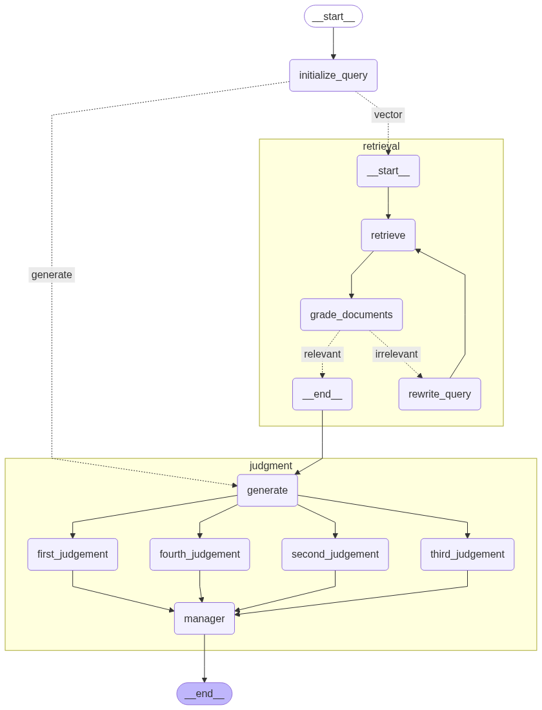

# Adaptive RAG 실습 2

## 개요
이 프로젝트는 Adaptive RAG(Retrieval-Augmented Generation) 구현을 위한 실습 프로젝트입니다. 
다양한 기술 스택을 활용하여 워크플로우를 구성하며, LangGraph를 중심으로 RAG 체인을 구현합니다.



- **참고 코드**: [LangChain-KR Adaptive RAG](https://github.com/teddylee777/langchain-kr/blob/main/17-LangGraph/02-Structures/07-LangGraph-Adaptive-RAG.ipynb)
- **사용 기술**:
  - FastAPI
  - LangGraph (+LangGraph Studio)
  - LangSmith
  - LangChain
  - PostgreSQL [FTS]
  - Milvus
  - Docker [docker-compose로 FastAPI, PostgreSQL, Milvus 통합]
  - Ollama (Local LLM)

- **생성형**:
  - deepseek-r1:14b (Ollama Local Model)

## 필자가 진행/생각한 구축 순서? (정답은 아님..)

1) 초기 단계
- langgraph 흐름을 그려봄 (노드/엣지 정의)
  > 노드(예: 검색, 생성)와 엣지(조건부 이동)를 시각화
- 스키마 정의
  > 어떤 값이 들어오고 나가는지 클래스명이나 변수(타입 등) 정의
  > 기본적인 상태 스키마 정의 + 다른 리턴 타입 스키마 정의 + FastAPI 쓰는 경우 스키마 정의
- 디렉토리 구조 정의
  > 어떻게 기능 분리를 할 지.. 요구사항을 고려했을 때 뭐가 필요한 지.
  > 모르겠다면 GPT, Grok 이 초안을 잘 짜주니 그걸 가지고 활용할 것.
- 체인 별 필요한 프롬포트 작성해서 prompts 밑에 yaml로 구성하기 
   > 자주 수정이 일어날 수 있으니 버전 관리 필수!

<느낀점> 교착 상태에 빠지지 않도록 제어하는 상태도 필요할 것으로 보임.
 예시) 웹검색과 리트리버 검색이 그래프에 있을 때 
 리트리버에 관련없는 질문 시 / 웹검색 결과는 리트리버 검색에 없는 내용일 것이므로 / 리트리버에서 잘못된 결과를 반환하고 / 관련없음 체크 시 다시 리트리버 / 무한루프


2) 구축 단계
 - 1) 에서 그린 흐름을 기반으로 node, edges, workflow 기본 껍데기는 만들어 놓기
   > 일단 안에는 빈 깡통 상태로!
- 벡터 DB 로직 만들기
- 생성형을 사용하는 체인 만들기
- 노드에 로직 구현
- 엣지에 로직 구현
- 메모리 쓰는 경우 구현 
  > PostgreSaver 써야 함. -> SqliteSaver나 MemorySaver는 LangGraph Studio에서 지원 안함ㅠ
- 로그 붙이기
   
<느낀점> 로직 작성하다 보면 실수 많이 나오더라..
unit_test를 하나 파서 Jupyter Notebook에서 단위 테스트를 해놓는 게 좋음.
가령, chain 별 단위 테스트는 필수적인 것을 체감했음.

<느낀점> 체인을 노드 전용 / 엣지 전용 체크해놓으면 좋음. 
많아지면 뭐가 뭔지 헷갈림


3) 테스트
- LangGraph 통합 테스트 (단위 테스트가 완료되었다는 가정 하에 진행 / LangGraph Studio 이용)
- 질문 케이스 작성 
  > 다양한 경로를 왔다갔다 하면서 교착이 생기는 지, 모든 케이스 테스트 필요

4) 앞에서 구축된 LangGraph를 모듈화하여 확장 
- FastAPI
  > 필요 시, Batch 추가
- Docker


## 디렉토리 구조 (2025.06.10 기준)
```plaintext
adaptive-rag-public/
│
├── data/                   # docker Volume, file 등
│  
├── routers/                   # FastAPI
│   ├── api.py
│
├── chains/                   # 체인 관련 로직 (재사용 가능한 체인 정의)
│   ├── __init__.py
│   ├── rag_chain.py          # RAG 체인
│
├── tools/                    # 외부 도구 관련 (Tavily 등)
│   ├── __init__.py
│   ├── search.py         # 웹 검색 도구 (Tavily 기반)
│
├── vectorstore/              # 벡터 DB 관련 (임베딩 및 검색)
│   ├── __init__.py
│   ├── pdf.py                # PDF -> 텍스트 변환 및 임베딩
│
├── graph/                    # LangGraph 워크플로우 정의
│   ├── __init__.py
│   ├── nodes.py              # 노드 정의 (web_search, generate, transform_query 등)
│   ├── edges.py              # 조건부 라우팅 로직 (add_conditional, 라우팅 함수)
│   ├── checkpointer.py       # 메모리 정의 (PostgreSaver, SqliteSaver)
│   ├── workflow.py           # 전체 워크플로우 구성
│
├── schemas/                  # 데이터 스키마 정의 (입력/출력 형식)
│   ├── __init__.py
│   ├── fastapi_schema.py     # FastAPI 결과 스키마
│   ├── web_search_schema.py  # 웹 검색 결과 스키마
│   ├── state_schema.py       # 그래프 상태 스키마
│   ├── return_value_schema.py # 각 노드의 반환 값 스키마
│
├── unit_test/                # Jupyter Notebook Unit Test
│   ├── keyword_data_insert.ipynb # PostgreSQL FTS Test
│   ├── semantic_data_insert.ipynb # Milvus Test
│   ├── reranker_data_test.ipynb # Milvus Test
│   ├── langgraph_chain_test.ipynb # Langgraph Unit Test
│
│
├── templates/                # 정적 파일
│   ├── static/               # PostgreSQL FTS Test
│   ├── swagger/              # FastAPI 내부망용 css, js 포함
│   ├── index.html            # 프론트 템플릿 (미구현)
│
├── utils/                    # 유틸리티 및 로깅
│   ├── logger               # 로깅 파일
│   ├── postgresql.py   # PostgreSQL DB 로직 파일
│   ├── milvus.py             # Milvus DB 로직 파일
│   ├── reranker.py             # 리랭킹 로직 파일
│   ├── utils.py             # 로직 파일
│
├── configs/                  # 설정 파일 (모델, 프롬프트 등)
│   ├── __init__.py
│   ├── prompt               # 프롬프트 yaml 파일들
│   ├── model_config.py      # 모델 초기화 설정
│
├── langgraph.json            # LangGraph Server 실행 정보 (Dependency 등)
├── main.py                   # 워크플로우 실행 진입점
├── docker-compose.yml      # Milvus / PostgreSQL 서버 기동
└── requirements.txt          # 필요한 패키지 목록

```

3.
To-do


4.
Execute Server Info
- langgraph dev (langgraph.json 위치에서 실행)
- uvicorn main:app --reload (main.py 위치에서 실행)


5. 
기타 이슈 해결사항은 issue 탭에 게시


6. 버전 충돌로 해당 라이브러리는 주석 처리하여 진행

langgraph-runtime-inmem==0.2.0

langgraph-api==0.2.34

sse-starlette==2.1.3
